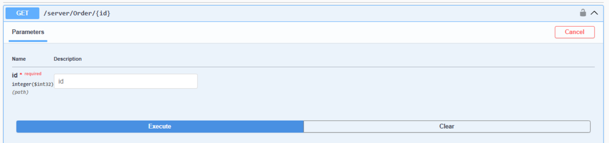
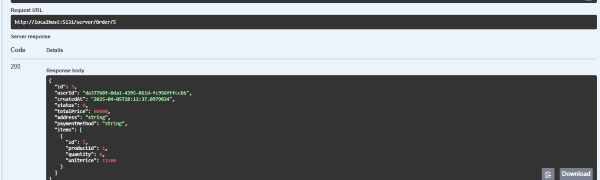

# Проверка требований
[Полное описание ТЗ](https://docs.google.com/document/d/1dwJWPPhUwVRXTw2K4k3pWqsp9jxoxdvqpK7RzFbWMzo/edit?tab=t.0)

### 1. Реализовать два микросервиса:
    1.	Order Service — сервис оформления заказов.
	2.	Product Service — сервис, хранящий информацию о продуктах.
        •	API-документация: Swagger (если используется REST)
        •	Аутентификация/Авторизация (опционально): JWT или IdentityServer (для продвинутого уровня) через KeyClock

API-документация: Swagger (если используется REST):


### 2. Функциональные требования
    Product Service
        •	GET /products/{id} — получить информацию о продукте
        •	POST /products — добавить новый продукт
        •	PUT /products/{id}/stock — изменить количество на складе


GET /products/ — получить информацию о всех продуктах:


```C#

[HttpGet]
public async Task<IActionResult> GetAll([FromQuery] QueryObject query)
{
    if (!ModelState.IsValid)
        return BadRequest(ModelState);
    
    var products = await _productRepo.GetAllAsync(query);
    if(products == null) return NotFound();


    var productDto = products.Select(s => s.ToProductDto()).ToList();
    return Ok(productDto);
}

public async Task<List<Product>> GetAllAsync(QueryObject query)
{
    var products = _context.Products.AsQueryable();

    if (!string.IsNullOrWhiteSpace(query.Name))
    {
        string titleLower = query.Name.ToLower();
        products = products.Where(s => s.Name.ToLower().Contains(query.Name));
    }

    if (!string.IsNullOrWhiteSpace(query.SortBy))
    {
        if (query.SortBy.Equals("Name", StringComparison.OrdinalIgnoreCase))
        {
            products = query.IsDescending ? products.OrderByDescending(s => s.Name) : products.OrderBy(s => s.Name);
        }
    }

    int pageSize = query.PageSize > 0 ? query.PageSize : 10;
    int pageNumber = query.PageNumber > 0 ? query.PageNumber : 1;

    var skipNumber = (pageNumber - 1) * pageSize;

    return await products.Skip(skipNumber).Take(pageSize).ToListAsync();
}

```

GET /products/{id} — получить информацию о продукте:


```C#

[HttpGet("{id}")]
public async Task<IActionResult> GetById([FromRoute] int id)
{
    if (!ModelState.IsValid)
        return BadRequest(ModelState);

    var product = await _productRepo.GetByIdAsync(id);
    if(product == null) return NotFound();
    
    return Ok(product.ToProductDto());
}

public async Task<Product?> GetByIdAsync(int id)
{
    return await _context.Products.FirstOrDefaultAsync(i => i.Id == id);
}

```

POST /products — добавить новый продукт:


```C#

[HttpPost]
public async Task<IActionResult> Create([FromForm] CreateProductDto productDto)
{

    if (!ModelState.IsValid)
        return BadRequest(ModelState);

    var productModel = productDto.ToProductFromCreateDTO();
    if (productModel == null) return NotFound();

    await _productRepo.CreateAsync(productModel);

    return CreatedAtAction(nameof(GetById), new { id = productModel.Id }, productModel.ToProductDto());
}

public async Task<Product> CreateAsync(Product productModel)
{
    await _context.Products.AddAsync(productModel);
    await _context.SaveChangesAsync();
    return productModel;
}

```

PUT /products/{id} — изменить Продукт:


```C#

[HttpPut]
[Route("{id}")]
public async Task<IActionResult> Update([FromRoute]int id, [FromForm] UpdateProductDto updateDto)
{
    if (!ModelState.IsValid)
        return BadRequest(ModelState);
    
    var productModel = await _productRepo.UpdateAsync(id, updateDto);
    if (productModel == null) return NotFound();

    return Ok(productModel.ToProductDto());
}

public async Task<Product?> UpdateAsync(int id, UpdateProductDto productDto)
{
    var existingProduct = await _context.Products.FirstOrDefaultAsync(x => x.Id == id);
    if (existingProduct is null) return null;

    existingProduct.Name = productDto.Name;
    existingProduct.Description = productDto.Description;
    existingProduct.Price = productDto.Price;

    await _context.SaveChangesAsync();
    return existingProduct;
}

```
PUT /products/{id}/stock — изменить количество на складе:


```C#

[HttpPut]
[Route("{id}/stock")]
public async Task<IActionResult> UpdateStock([FromRoute]int id, [FromBody] UpdateProductStockDto updateDto)
{
    if (!ModelState.IsValid)
        return BadRequest(ModelState);
    
    var productModel = await _productRepo.UpdateStockAsync(id, updateDto);
    if (productModel == null) return NotFound();

    return Ok(productModel.ToProductDto());
}

public async Task<Product?> UpdateStockAsync(int id, UpdateProductStockDto productDto)
{
    var existingStock = await _context.Products.FirstOrDefaultAsync(x => x.Id == id);
    if (existingStock is null) return null;

    var newStock = existingStock.Stock + productDto.Quantity;
    if (newStock < 0)
        throw new InvalidOperationException("Not enough stock.");

    existingStock.Stock = newStock;
    await _context.SaveChangesAsync();
    return existingStock;
}

```

### 3. Функциональные требования
    Order Service
        •	POST /orders — создать заказ:
        •	Проверить наличие продукта через Product Service
        •	Зарезервировать продукт
        •	Создать заказ
        •	GET /orders/{id} — получить информацию о заказе


POST /orders — создать заказ:


```C#

[Authorize]
[HttpPost("create-orders")]
public async Task<IActionResult> CreateOrder([FromBody] CreateOrderRequestDto orderModel)
{
    try
    {
        var userId = User.GetUserId();
        if(userId == null) return NotFound();

        var order = await _orderRepo.CreateOrderAsync(userId, orderModel);
        return CreatedAtAction(nameof(GetById), new { id = order.Id }, order.ToOrderUserDto());
    }
    catch (Exception ex)
    {
        _logger.LogError(ex, "Error creating order: {Message}", ex.Message);
        return StatusCode(500, ex.Message);
    }
}

public async Task<Order> CreateOrderAsync(string userId, CreateOrderRequestDto orderDto)
{
    await using var transaction = await _context.Database.BeginTransactionAsync();

    try
    {
        decimal totalPrice = 0;
        var orderItems = new List<OrderItem>();

        foreach (var item in orderDto.OrderItems)
        {
            var product = await _productService.GetProductByIdAsync(item.ProductId);
            if (product == null)
                throw new InvalidOperationException($"Товар с ID {item.ProductId} не найден");

            if (product.Quantity < item.Quantity)
                throw new InvalidOperationException($"Недостаточно товара (ID {item.ProductId}) на складе");

            var reserved = await _productService.ReserveProductStockAsync(item.ProductId, item.Quantity);
            if (!reserved)
                throw new InvalidOperationException($"Не удалось зарезервировать товар (ID {item.ProductId})");

            totalPrice += product.Price * item.Quantity;

            orderItems.Add(new OrderItem
            {
                ProductId = item.ProductId,
                Quantity = item.Quantity,
                UnitPrice = product.Price
            });
        }

        // Создаём заказ
        var order = new Order
        {
            UserId = userId,
            CreatedAt = DateTime.UtcNow,
            Status = OrderStatus.Pending,
            TotalPrice = totalPrice,
            Address = orderDto.Address,
            PaymentMethod = orderDto.PaymentMethod,
            Items = orderItems
        };

        _context.Orders.Add(order);
        await _context.SaveChangesAsync();
        await transaction.CommitAsync();

        return order;
    }
    catch (Exception ex)
    {
        Console.WriteLine($"Ошибка при создании заказа: {ex.Message}");
        await transaction.RollbackAsync();
        throw;
    }

}

```


По соответствию принципам микросервисной архитектуры, 
где каждый сервис изолирован и общение идёт через API.
Был создать класс ProductHttpClientService.


Проверить наличие продукта через Product Service:
```C#

public async Task<ProductDto?> GetProductByIdAsync(int productId)
{
    var response = await _httpClient.GetAsync($"/server/product/{productId}");
    if (!response.IsSuccessStatusCode)
        return null;

    return await response.Content.ReadFromJsonAsync<ProductDto>();
}

```

Зарезервировать продукт:
```C#

public async Task<bool> ReserveProductStockAsync(int productId, int quantity)
{
    var content = JsonContent.Create(new { Quantity = -quantity }); // УМЕНЬШАЕМ stock
    var response = await _httpClient.PutAsync($"/server/product/{productId}/stock", content);
    return response.IsSuccessStatusCode;
}

```

GET /orders/{id} — получить информацию о заказе:


```C#

[HttpGet("{id}")]
public async Task<IActionResult> GetById([FromRoute] int id)
{
    if (!ModelState.IsValid)
        return BadRequest(ModelState);

    var order = await _orderRepo.GetByIdAsync(id);
    if(order == null) return NotFound();
    
    return Ok(order.ToOrderUserDto());
}

 public async Task<Order?> GetByIdAsync(int id)
 {
     return await _context.Orders.Include(e => e.Items).FirstOrDefaultAsync(i => i.Id == id);
 }

```

GET /orders/user-order — получить информацию о заказе пользователья:


```C#

[Authorize]
[HttpGet("user-orders")]
public async Task<IActionResult> UserOrders()
{
    if (!ModelState.IsValid)
        return BadRequest(ModelState);

    var userId = User.GetUserId();
    if(userId == null) return NotFound();

    var orders = await _orderRepo.GetUserOrdersAsync(userId);
    if(orders == null) return NotFound();

    var ordersDto = orders.Select(s => s.ToOrderUserDto()).ToList();
    return Ok(ordersDto);
}

public async Task<List<Order>> GetUserOrdersAsync(string userId)
{
    var orders = await _context.Orders
            .Include(c => c.Items)
            .Where(a => a.UserId == userId && !a.IsDeleted)
            .ToListAsync();
    
    return orders;
}

```

Аутентификация/Авторизация (опционально): JWT или IdentityServer:

Вход:


```C#

[HttpPost("login")]
public async Task<IActionResult> Login([FromBody] LoginDto loginDto)
{
    if (!ModelState.IsValid)
        return BadRequest(ModelState);

    var isEmail = IsValidEmail(loginDto.Email); //Проверяем, является ли введённый логин настоящим Email
    var user = isEmail // Ищем пользователя одним вызовом (FindByEmailAsync) или (FindByNameAsync)
        ? await _userManager.FindByEmailAsync(loginDto.Email)
        : await _userManager.FindByNameAsync(loginDto.Email);

    if(user == null)
    return Unauthorized("Invalid username or password.");

    var result = await _signInManager.PasswordSignInAsync(user.UserName, loginDto.Password, loginDto.RememberMe, lockoutOnFailure: false);


    if (result.Succeeded)
    {
        return Ok(
            new NewUserDto
            {
                Id = user.Id,
                UserName = user.UserName,
                Email = user.Email,
                Token = _tokenService.CreateToken(user)
            }
        );
    }

    if (result.IsLockedOut)
        return Unauthorized("User account locked out.");

    return Unauthorized("Invalid login attempt.");
}

```

Регистрация:


```C#

[HttpPost("register")]
public async Task<IActionResult> Register([FromBody] RegisterDto registerDto)
{
    if (!ModelState.IsValid)
        return BadRequest(ModelState);

    var existingUser = await _userManager.FindByEmailAsync(registerDto.Email);
    if (existingUser != null)
        return BadRequest("Email is already in use.");

    var appUser = new AppUser
    {
        UserName = registerDto.Username,
        Email = registerDto.Email,
    };

    var createdUser = await _userManager.CreateAsync(appUser, registerDto.Password);
    if (!createdUser.Succeeded)
        return BadRequest(createdUser.Errors);

    var roleResult = await _userManager.AddToRoleAsync(appUser, "User");
    if (!roleResult.Succeeded)
        return StatusCode(500, roleResult.Errors);

    return Ok(new NewUserDto
    {
        Id = appUser.Id,
        UserName = appUser.UserName,
        Email = appUser.Email,
        Token = _tokenService.CreateToken(appUser)
    });
}

```